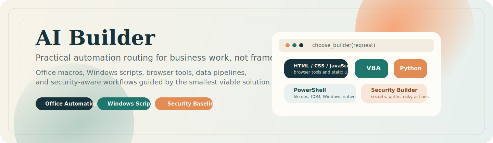

<p align="center">
  
</p>

<p align="center">
  <a href="https://github.com/StealthyLabsHQ/ai-builder-skill/blob/main/LICENSE"></a>
  
  
</p>

<p align="center">
  A practical skill hub for Office automation, Windows scripting, lightweight browser tools, data workflows, and security-aware code generation.
</p>

## What AI Builder Is

AI Builder is a routing-first skill repository for practical automation work.

It helps an AI assistant choose the right implementation path before code is written:

- `HTML/CSS/JavaScript` for lightweight browser tools and static frontends
- `VBA` for Office desktop macros and workbook logic
- `PowerShell` for Windows-native automation and COM workflows
- `Python` for data pipelines, reporting, and maintainable scripting
- `Security-first guidance` for risky or high-impact automation

This repository is optimized for real operating work:

- Excel cleanup and workbook automation
- Windows file and folder tasks
- internal dashboards and browser tools
- report generation from CSV or export data
- safer handling of secrets, paths, commands, and destructive actions

## Why It Exists

Most internal automation requests do not need an app framework.

They need the smallest viable implementation that fits the user's actual environment, setup burden, and skill level. AI Builder exists to make those requests routable, consistent, and safer by default.

It is especially useful when the person asking for help is close to spreadsheets, reports, folders, exports, and internal business processes rather than full-time software engineering.

## Routing Model

| Request type | Default route |
|---|---|
| Lightweight browser tool, static dashboard, or no-framework frontend | `references/builders/html-css-javascript-builder.md` |
| Office desktop macro or existing macro maintenance | `references/builders/vba-builder.md` |
| Windows-native automation or operational scripting | `references/builders/powershell-builder.md` |
| Cross-file data processing or maintainable automation | `references/builders/python-builder.md` |
| Hardening, audit, risky automation, secrets, or high-impact operations | `references/builders/security-builder.md` |
| No-code, admin, or office-heavy request with no explicit language | `references/builders/office-script-builder.md` first |

If the request is ambiguous, the skill should choose the safest practical option with the lowest setup burden.

## What Makes It Different

### 1. Routing before coding

The main job is not to generate code blindly. The main job is to pick the right execution path first.

### 2. Built for practical users

The output model is designed for people who need copy-paste-ready automation with clear run instructions, not architecture lectures.

### 3. Security is part of the workflow

The repository includes a shared security baseline for tasks involving:

- secrets, credentials, tokens, or signed URLs
- downloads, web requests, and external content
- command execution and external processes
- file overwrite, deletion, move, or rename operations
- Office automation, email, exports, and PII-bearing flows
- AI-assisted or agent-driven automation with untrusted input

The security guidance is intentionally pragmatic and adapted from the excellent `StealthyLabsHQ/security-hardening` corpus to fit this narrower business-automation scope.

## Example Requests

```text
Clean this workbook, remove blank rows, and highlight duplicate invoice IDs.
```

```text
Build a small HTML/CSS/JavaScript dashboard to track weekly sales KPIs.
```

```text
Rename all PDF files in this Windows folder using the date in the filename.
```

```text
Merge these CSV exports and generate a simple Excel report in Python.
```

```text
Fix this existing VBA macro and make it safer before it sends Outlook emails.
```

```text
Review this PowerShell script for dangerous patterns and harden it.
```

For more concrete routing examples, see [examples/concrete-use-cases.md](examples/concrete-use-cases.md).

## Repository Layout

```text
.
|-- .github/
|   `-- workflows/
|       `-- ci.yml
|-- .claude/
|   `-- settings.example.json
|-- .gemini/
|   `-- settings.example.json
|-- AGENTS.md
|-- CHANGELOG.md
|-- CLAUDE.md
|-- CLAUDE.local.example.md
|-- GEMINI.md
|-- GEMINI.local.example.md
|-- LICENSE
|-- README.md
|-- SKILL.md
|-- agents/
|   `-- openai.yaml
|-- assets/
|   |-- ai-builder-banner.svg
|   `-- ai-builder-social-preview.svg
|   `-- starters/
|       |-- html-tool/
|       |-- powershell-script/
|       |-- python-cli/
|       `-- vba-module/
|-- eval/
|   `-- routing-cases.json
|-- examples/
|   |-- browser-kpi-tool/
|   |-- concrete-use-cases.md
|   |-- prompt-cookbook.md
|   |-- security/
|   |-- powershell/
|   |-- python/
|   `-- vba/
`-- references/
    |-- builders/
    |   |-- html-css-javascript-builder.md
    |   |-- office-script-builder.md
    |   |-- powershell-builder.md
    |   |-- python-builder.md
    |   |-- security-builder.md
    |   `-- vba-builder.md
    |-- platforms/
    |   |-- claude-code-hooks.md
    |   |-- claude-code.md
    |   |-- codex-claude-gemini-crosswalk.md
    |   |-- codex-task-shaping.md
    |   |-- codex.md
    |   `-- gemini-cli.md
    |-- rules/
    |   |-- output-and-safety.md
    |   |-- risk-trigger-matrix.md
    |   `-- security-baseline.md
    `-- templates/
        `-- builder-template.md
|-- scripts/
|   |-- check_eval_cases.py
|   `-- validate_repo.py
```

## Start Here

If you are using this repository as a skill source:

1. Read [SKILL.md](SKILL.md) for the orchestration logic.
2. Read [references/builders/office-script-builder.md](references/builders/office-script-builder.md) for office-heavy and admin-heavy routing.
3. Load the matching builder for the request.
4. Load [references/rules/security-baseline.md](references/rules/security-baseline.md) when the task touches risky operations.
5. Load [references/rules/risk-trigger-matrix.md](references/rules/risk-trigger-matrix.md) if the risk is implicit or mixed.

## Install

Use the repository in the simplest way your AI tool supports:

### Codex-style project instructions

- keep the repository as-is in your working context, or
- reuse [AGENTS.md](AGENTS.md) and [SKILL.md](SKILL.md) in the project where you want the routing behavior

### Claude-style local skills

- point Claude at the repository root as a local skill source
- use [CLAUDE.md](CLAUDE.md) as the thin Claude adapter
- copy [.claude/settings.example.json](.claude/settings.example.json) to `.claude/settings.json` if you want a shared project baseline
- copy [CLAUDE.local.example.md](CLAUDE.local.example.md) to `CLAUDE.local.md` for personal local-only overrides
- load `SKILL.md` as the primary instruction file
- keep the `references/` directory available alongside it

### Gemini CLI

- use [GEMINI.md](GEMINI.md) as the thin Gemini adapter, or
- configure Gemini CLI `context.fileName` to include `AGENTS.md`
- copy [.gemini/settings.example.json](.gemini/settings.example.json) to `.gemini/settings.json` for a conservative workspace baseline
- use [GEMINI.local.example.md](GEMINI.local.example.md) as a personal overlay to import from your global or project `GEMINI.md`
- keep `references/` available so Gemini can load only the relevant builder, rule, or platform reference

### Cursor or editor-agent workflows

- use the repository as project context or copy the relevant files into your workspace rules setup
- keep `references/builders/` and `references/rules/` intact so routing and safety remain discoverable

### Generic AI setup

- start with [SKILL.md](SKILL.md)
- add [AGENTS.md](AGENTS.md) when the tool supports persistent repo instructions
- keep [references/](references) available so the assistant can load only what it needs

## Distribution Metadata

This repository now ships UI-facing metadata for skill-aware platforms in [agents/openai.yaml](agents/openai.yaml).

That file is intended for harnesses and skill lists, while [SKILL.md](SKILL.md) remains the canonical behavior layer.

Versioned release notes live in [CHANGELOG.md](CHANGELOG.md).
Draft GitHub release bodies live in [release-notes/](release-notes).

## Platform References

The repository now includes agent-specific adaptation references:

- [references/platforms/codex.md](references/platforms/codex.md)
- [references/platforms/codex-task-shaping.md](references/platforms/codex-task-shaping.md)
- [references/platforms/claude-code.md](references/platforms/claude-code.md)
- [references/platforms/claude-code-hooks.md](references/platforms/claude-code-hooks.md)
- [references/platforms/gemini-cli.md](references/platforms/gemini-cli.md)
- [references/platforms/codex-claude-gemini-crosswalk.md](references/platforms/codex-claude-gemini-crosswalk.md)

Use them when the target runtime matters as much as the programming language.

The repository also ships ready-to-use root adapters:

- [CLAUDE.md](CLAUDE.md)
- [GEMINI.md](GEMINI.md)
- [CLAUDE.local.example.md](CLAUDE.local.example.md)
- [GEMINI.local.example.md](GEMINI.local.example.md)
- [.claude/settings.example.json](.claude/settings.example.json)
- [.gemini/settings.example.json](.gemini/settings.example.json)

## Examples And Starters

### Executable examples

- [examples/vba/clean-invoices.bas](examples/vba/clean-invoices.bas)
- [examples/powershell/rename-pdfs-by-date.ps1](examples/powershell/rename-pdfs-by-date.ps1)
- [examples/python/merge-csv-report.py](examples/python/merge-csv-report.py)
- [examples/browser-kpi-tool/](examples/browser-kpi-tool)
- [examples/security/unsafe-to-safe.md](examples/security/unsafe-to-safe.md)

### Prompt guidance

- [examples/prompt-cookbook.md](examples/prompt-cookbook.md)
- [examples/concrete-use-cases.md](examples/concrete-use-cases.md)

### Starter kits

- [assets/starters/html-tool/](assets/starters/html-tool)
- [assets/starters/python-cli/](assets/starters/python-cli)
- [assets/starters/powershell-script/](assets/starters/powershell-script)
- [assets/starters/vba-module/](assets/starters/vba-module)

## Evaluation And CI

The repository now includes:

- routing fixtures in [eval/routing-cases.json](eval/routing-cases.json)
- repository validation in [scripts/validate_repo.py](scripts/validate_repo.py)
- evaluation fixture validation in [scripts/check_eval_cases.py](scripts/check_eval_cases.py)
- GitHub Actions CI in [.github/workflows/ci.yml](.github/workflows/ci.yml)

The goal is simple: make the skill testable as a routing system, not just readable as documentation.

## Who This Is For

AI Builder is especially useful for:

- operations and back-office teams
- analysts working with Excel and CSV exports
- Windows admins and power users
- founders automating internal workflows
- AI users who want practical scripts instead of generic prompt bundles

## Visual Assets

The repository includes:

- [assets/ai-builder-banner.svg](assets/ai-builder-banner.svg) for the README hero
- [assets/ai-builder-social-preview.svg](assets/ai-builder-social-preview.svg) as a ready-made social preview asset for GitHub repo settings

## Roadmap Direction

Likely next extensions:

- richer Office-specific security guidance
- reusable static frontend patterns and examples
- more concrete VBA, PowerShell, Python, and browser-tool workflows
- stronger install adapters for multiple AI tooling environments
- audit-oriented references for no-code and connector-heavy operations

## License

This repository uses the [MIT License](LICENSE).
